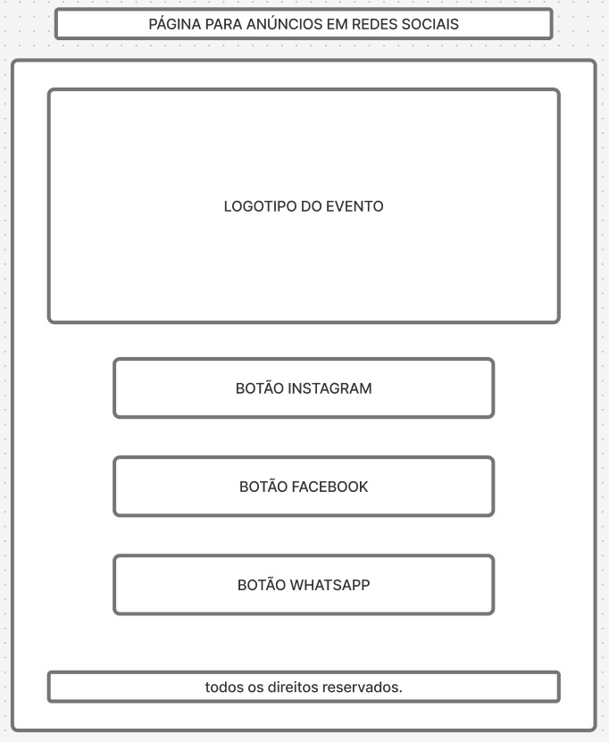
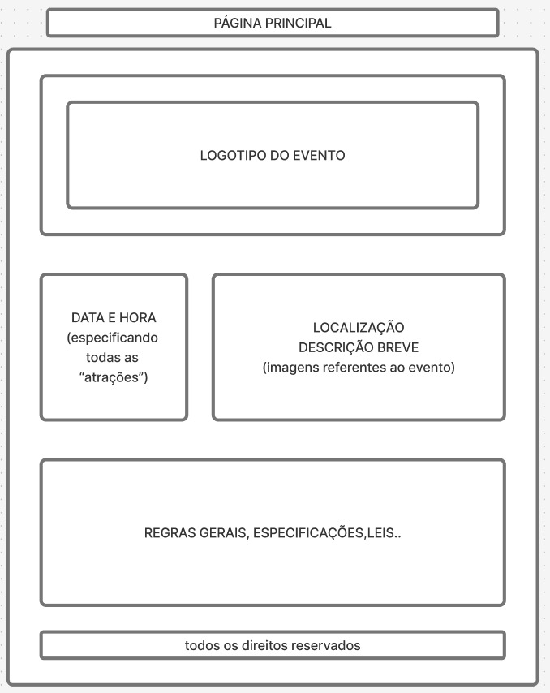

# Página de evento - GDG Londrina 

## Descrição do projeto

O projeto, idealizado e proposto pelo Prof. Me. Leonardo Rocha, responsável pela disciplina de programação WEB tem como objetivo a criação de uma página para a divulgação do evento Google Developer Groups (GDG) que ocorre na cidade de Londrina - PR, tendo como público alvo entusiastas em tecnologias que podem ter interesse em participar deste MeetUp.

## Idealização do projeto

Segue abaixo o mapa mental elaborado por nós, contendo todas as ideias necessárias para o início do projeto.

## Protótipos de baixa fidelidade

Segue abaixo o protótipo de duas telas do nosso projeto, a primeira, sendo nossa tela inicial, contendo o nome do evento juntamente das opções para seguirem para o instagram, página oficial e nossa página de apresentação, o segundo protótipo é da nossa tela de apresentação do evento, contendo cabeçalho, a data de cada evento, as descrições, regras e especificações de cada evento.

## Tecnologias a serem utilizadas.

HTML (HyperText Markup Language): É a linguagem de marcação usada para estruturar conteúdo na web. O HTML define a estrutura básica das páginas, como títulos, parágrafos, links, imagens e outros elementos. Ele fornece a espinha dorsal de uma página da web.

CSS (Cascading Style Sheets): É a linguagem responsável pela estilização das páginas da web. O CSS define como o conteúdo HTML será exibido, como cores, fontes, tamanhos, espaçamentos e layout. Ele permite que você crie designs atraentes e responsivos.

JavaScript (JS): É uma linguagem de programação que adiciona interatividade e dinamismo às páginas da web. Com JavaScript, você pode manipular elementos HTML e CSS em tempo real, criar animações, validar formulários, interagir com servidores e muito mais.
