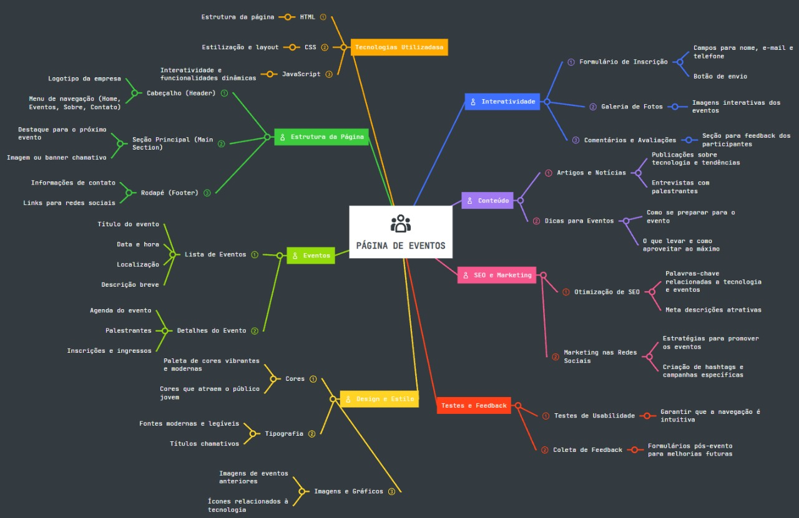

# Página de evento - GDG Londrina 

## Descrição do projeto

O projeto, idealizado e proposto pelo Prof. Me. Leonardo Rocha, responsável pela disciplina de programação WEB tem como objetivo a criação de uma página para a divulgação do evento Google Developer Groups (GDG) que ocorre na cidade de Londrina - PR, tendo como público alvo entusiastas em tecnologias que podem ter interesse em participar deste MeetUp.

## Idealização do projeto

Segue abaixo o mapa mental elaborado por nós, contendo todas as ideias necessárias para o início do projeto.

