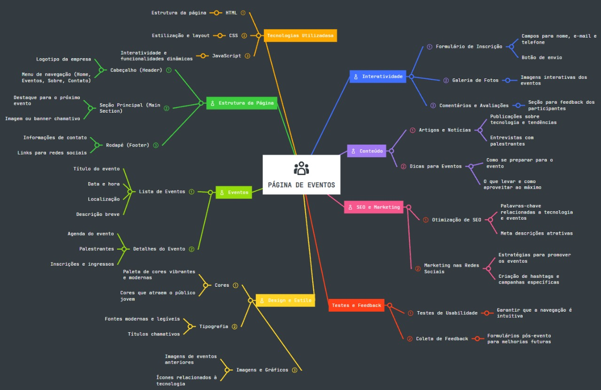
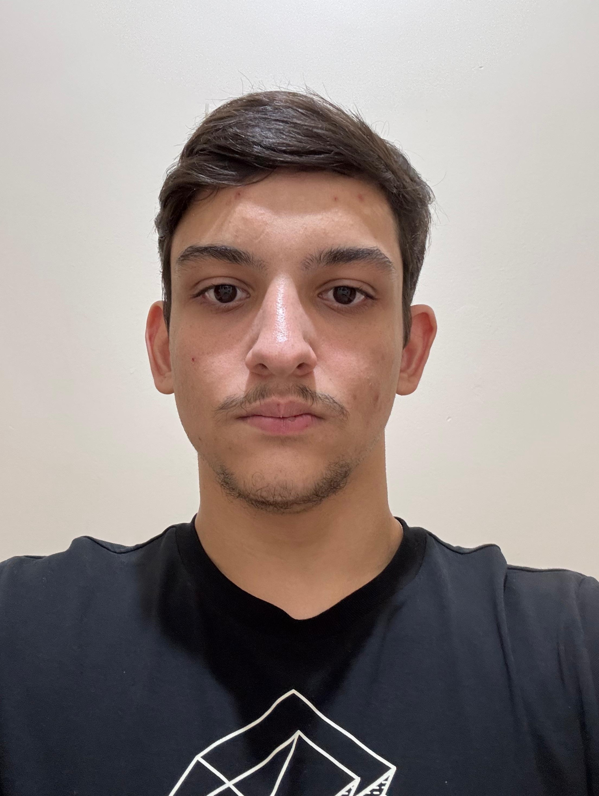

# 🌐 GDG Londrina - Página de Apresentação de Evento

Este repositório contém o código-fonte do site oficial do **GDG Londrina Meetup Maio 2025**, desenvolvido com foco em acessibilidade, performance visual e uma apresentação dinâmica de informações sobre o evento. A página é responsiva e oferece seções detalhadas sobre a programação, palestrantes, galeria de fotos, eventos passados e equipe organizadora.

## Descrição do projeto

O projeto, idealizado e proposto pelo Prof. Me. Leonardo Rocha, responsável pela disciplina de programação WEB tem como objetivo a criação de uma página para a divulgação do evento Google Developer Groups (GDG) que ocorre na cidade de Londrina - PR, tendo como público alvo entusiastas em tecnologias que podem ter interesse em participar deste MeetUp.

## Idealização do projeto

Segue abaixo o mapa mental elaborado por nós, contendo todas as ideias necessárias para o início do projeto.

## 🎯 Funcionalidades

- Página inicial com partículas animadas e botões de acesso rápido.
- Modal de inscrição com QR Code e link externo.
- Galeria de fotos com carrossel animado.
- Cards interativos para eventos passados com links externos.
- Lista de palestras e localização detalhada do evento.
- Apresentação dos organizadores com links para redes sociais.
- Ícones flutuantes para retorno ao formulário e ajuda.

## 🧰 Tecnologias Utilizadas

- HTML5
- CSS3 (com animações, media queries e efeito Glassmorphism)
- JavaScript (DOM, canvas e carrossel de imagens)
- EmailJS (para envio de e-mails via formulário)
- Font Awesome (ícones)
- Google Fonts: Orbitron
- Responsividade via Media Queries

## 📁 Estrutura de Diretórios

├── index.html - Página inicial com animação de partículas  
├── principal.html - Página de apresentação do evento  
├── css/  
│ ├── styles.css - Estilos da tela inicial  
│ └── principal.css - Estilos da tela principal do evento  
├── js/  
│ ├── script.js - Carrossel, modal e manipulação de DOM  
│ └── particles-canvas.js - Animação de partículas no background  
├── media/  
│ └── [imagens do evento, palestrantes e logos]  

📱 Responsividade
A aplicação foi testada e adaptada para diversos tamanhos de tela (desktop, tablet e dispositivos móveis) com media queries, mantendo a identidade visual e a usabilidade.

## 🧑‍💻 Desenvolvedores

[Gabriel Gonzales](https://www.linkedin.com/in/gabrielpgonzales/)  &    [Rennan Rentz](https://www.linkedin.com/in/rennan-rentz-lopes-da-silva-954353319/)

## Google Developer Group - Londrina  
Conectando pessoas, compartilhando conhecimento, construindo o futuro da tecnologia. 🚀

